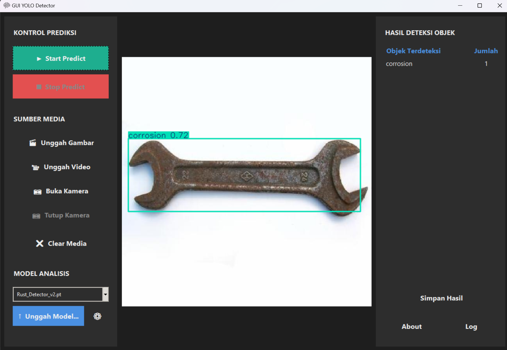

# GUI Object Detection with YOLO


A GUI with object detection using **Ultralytics YOLO**. it also use for real-time detection, scanning object on picture and video,
and counting object based on category.



## 📋 Features

* **Selected Model Management**: Selected the specified YOLO model (e.g., `yolo12n.pt`) and can upload YOLO model from external 
* **Directory Organization**: Automatically manages model storage in a dedicated `models/` directory.
* **Robust Error Handling**: Includes checks for webcam availability and yolo model availability

## 🛠️ Prerequisites

Before running the program, ensure you have the following installed:
* **Python 3.8+**
* A working **Webcam** (optional)

## 📦 Installation

1.  **Clone the repository** (if you are using Git):
    ```bash
    git clone (https://github.com/Rizqidx/object-detector.git)
    cd object-detector
    ```

2.  **Set up a Virtual Environment** (Recommended):
    ```bash
    # Windows
    python -m venv gui_env
    .\gui_env\Scripts\activate
    ```

3.  **Install Dependencies**:
    Use the provided `requirements.txt` file to install the necessary libraries.
    ```bash
    pip install -r requirements.txt
    ```

**Optional** (Windows Only):
    if you still difficult following the step, you can click and running `Setup.bat` file
    to setup virtual environment easily

## 🚀 Usage

To start the detection program, run the Python script:

```bash
python Training_Program.py
```

**Optional** (Windows Only):
    or you can click and running `Run_GUI_Detector.bat` file to running python script easily